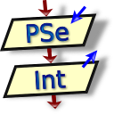

	
# __Platform Conqueror__ 	:computer:

<h2 align="center" >Hi :wave: I'm a developer</h2>

###  Everyone says there is a limit to everything. But few break that limit and exceed even more...

#### `Hi` I'm Diego Román Guerra. 

	

---

## About me:

- :mag: I like to investigate new technologies and understand their implementation today
- :chart_with_upwards_trend: I like to analyze and provide solutions with improvements in the projects I develop
- :coffee: Coffee lover
- :envelope: How to reach me **roman.haa31@gmail.com**
  /*- :keyboard: I'm currently learming "Python"*/
  
 

## __GitHub Readme Streak Stats__

 

---

## :paperclip: Languages I implement as a developer

<table border="2">
	<tr>
		<td align="center" valign="middle" >Programming   Languages</td>
		<td colspan="5" align="center" valign="middle" >Developed Languages</td>
	</tr>
	<tr align="center" valign="middle" >
		<td></td>
		<td></td>
		<td></td>
		<td></td>
		<td></td>
		<td></td>
	</tr>
</table>

 

# :computer: __Development environment__

  <table border="1" align="center">
    <tr>
	<th>Area de entrenamiento</th>
	<th>Campos Desbloqueados</th>
	<th>Logos</th>
   </tr>
    <tr>
   <td rowspan="5" align="center" valign="middle" ></td>
	<td>Pseint</td>
	<td align="center" valign="middle" ></td>
   </tr>
  <tr>
	   <td>NetBeans IDE 17</td>
	   <td align="center" valign="middle" ></td>
   </tr>
   <tr>
	   <td>Sublime Text</td>
	   <td align="center" valign="middle" ></td>
   </tr>
   <tr>
	   <td>Visual Studio Code</td>
	   <td align="center" valign="middle" ></td>
   </tr>
	   <tr>
	   <td>IntelliJ IDEA</td>
           <td align="center" valign="middle" ></td>
	  </tr>
  </table>	

	

