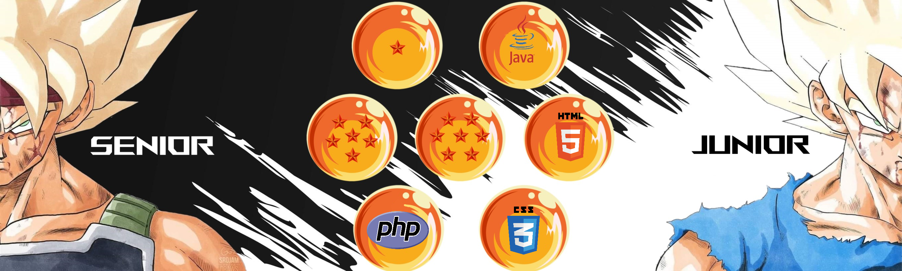

##  Conquistador de Plataformas 

###  Todos dicen que existe un límite para todo. Pero pocos rompen ese límite y se superan más

#### `Hola` soy Diego S. Román Guerra. 

---

# Compiladores - Terminales

  <table border="1">
    <tr>
	<th>Area de entrenamiento</th>
	<th>Campos Desbloqueados</th>
	<th>Logos</th>
	    
   </tr>
    <tr>
   <td rowspan="4"></td>
	<td>NetBeans IDE 8.2</td>
	<td></td>
   </tr>
   <tr>
	   <td>Sublime Text</td>
	   <td></td>
   </tr>
   <tr>
	   <td>Visual Studio Code</td>
	   <td></td>
   </tr>
	   <tr>
	   <td>IntelliJ IDEA</td>
           <td></td>
	  </tr>
  </table>

